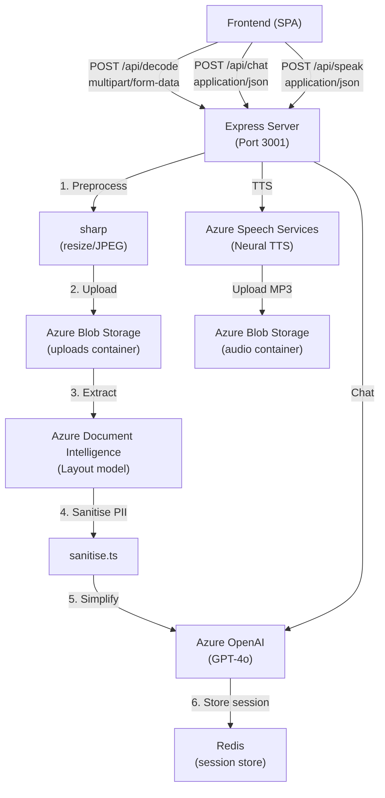

# Pehli Baar — Backend API

AI-powered document simplification backend for first-generation college students in India.

## Architecture



## Prerequisites

- **Node.js** 20+ (`node --version`)
- **npm** 10+ (`npm --version`)
- **Redis** running locally or via Docker
- **Azure subscription** with these resources provisioned:
  - Azure Document Intelligence
  - Azure OpenAI (GPT-4o deployment)
  - Azure Speech Services
  - Azure Blob Storage
  - (Optional) Azure Key Vault

## Quick Start

```bash
# 1. Install dependencies
npm install

# 2. Set up environment variables
cp .env.example .env
# Edit .env with your Azure credentials

# 3. Start Redis (if not already running)
docker run -d -p 6379:6379 redis

# 4. Start the development server
npm run dev
```

The server starts at `http://localhost:3001`.

## Environment Variables

| Variable | Required | Description |
|----------|----------|-------------|
| `DOC_INTEL_ENDPOINT` | ✅ | Azure Document Intelligence endpoint URL |
| `DOC_INTEL_KEY` | ✅* | API key (local dev; prod uses Key Vault) |
| `OPENAI_ENDPOINT` | ✅ | Azure OpenAI endpoint URL |
| `OPENAI_KEY` | ✅* | API key (local dev; prod uses Key Vault) |
| `OPENAI_DEPLOYMENT_NAME` | ✅ | GPT-4o deployment name (default: `gpt-4o`) |
| `SPEECH_REGION` | ✅ | Azure Speech Services region (e.g., `eastus`) |
| `SPEECH_KEY` | ✅* | API key (local dev; prod uses Key Vault) |
| `STORAGE_CONNECTION_STRING` | ✅* | Blob Storage connection string |
| `STORAGE_CONTAINER_UPLOADS` | ❌ | Upload container name (default: `uploads`) |
| `STORAGE_CONTAINER_AUDIO` | ❌ | Audio container name (default: `audio`) |
| `KEYVAULT_URI` | ❌ | Azure Key Vault URI (empty = use .env keys) |
| `APPINSIGHTS_CONNECTION_STRING` | ❌ | App Insights connection string |
| `REDIS_URL` | ❌ | Redis connection URL (default: `redis://localhost:6379`) |
| `PORT` | ❌ | Server port (default: `3001`) |
| `NODE_ENV` | ❌ | `development` or `production` |
| `API_KEY` | ❌ | API key for `x-api-key` auth (empty = no auth) |
| `MAX_FILE_SIZE_MB` | ❌ | Max upload size (default: `10`) |
| `SESSION_TTL_HOURS` | ❌ | Session expiry (default: `2`) |

\* In production, these are fetched from Azure Key Vault. In local dev, set them in `.env`.

## API Endpoints

### POST /api/decode

Upload a document for AI-powered simplification.

```bash
curl -X POST http://localhost:3001/api/decode \
  -H "x-api-key: local-dev-key-change-in-prod" \
  -F "file=@admission-letter.pdf" \
  -F "language=hi"
```

**Response** (SSE stream):
```
event: stage
data: extracting

event: stage
data: simplifying

event: stage
data: {"stage":"done","sessionId":"uuid","language":"hi","simplified_text":"...","key_actions":["..."],"deadline_dates":["..."],"follow_up_suggestions":["..."],"audio_available":true,"processing_time_ms":1847}
```

---

### POST /api/chat

Ask follow-up questions about a decoded document.

```bash
curl -X POST http://localhost:3001/api/chat \
  -H "Content-Type: application/json" \
  -H "x-api-key: local-dev-key-change-in-prod" \
  -d '{
    "sessionId": "uuid-from-decode",
    "message": "Scholarship kab milegi?",
    "language": "hi"
  }'
```

**Response**:
```json
{
  "sessionId": "uuid",
  "reply": "Teri letter mein likha hai ki scholarship October mein milegi...",
  "language": "hi",
  "turn": 1
}
```

---

### POST /api/speak

Convert text to audio using Azure Neural TTS.

```bash
curl -X POST http://localhost:3001/api/speak \
  -H "Content-Type: application/json" \
  -H "x-api-key: local-dev-key-change-in-prod" \
  -d '{
    "text": "आपको 15 जुलाई से पहले फीस जमा करनी है।",
    "language": "hi"
  }'
```

**Response**:
```json
{
  "audio_url": "https://storage.blob.core.windows.net/audio/uuid.mp3?sv=...",
  "expires_in_seconds": 7200,
  "voice_name": "hi-IN-SwaraNeural"
}
```

## Error Codes

| Code | HTTP Status | Description |
|------|-------------|-------------|
| `FILE_TOO_LARGE` | 413 | Upload exceeds 10 MB |
| `UNSUPPORTED_FORMAT` | 415 | File is not JPEG, PNG, WebP, or PDF |
| `DOCUMENT_UNREADABLE` | 422 | No readable text found in document |
| `LANGUAGE_NOT_SUPPORTED` | 400 | Invalid language code |
| `UPSTREAM_TIMEOUT` | 504 | Azure service took > 30 seconds |
| `SESSION_EXPIRED` | 410 | Session not found (expired or invalid) |
| `INVALID_REQUEST` | 400 | Missing or malformed request body |
| `UNAUTHORIZED` | 401 | Missing or invalid `x-api-key` |
| `RATE_LIMITED` | 429 | Too many requests (> 20/min) |
| `INTERNAL_ERROR` | 500 | Catch-all for unexpected failures |

## Scripts

| Command | Description |
|---------|-------------|
| `npm run dev` | Start dev server with hot reload (tsx watch) |
| `npm run build` | Compile TypeScript to `dist/` |
| `npm start` | Run compiled production build |
| `npm run typecheck` | Type-check without emitting files |

## Supported Languages

| Code | Language | TTS Voice |
|------|----------|-----------|
| `hi` | Hindi | hi-IN-SwaraNeural |
| `ta` | Tamil | ta-IN-PallaviNeural |
| `bn` | Bengali | bn-IN-TanishaaNeural |
| `mr` | Marathi | mr-IN-AarohiNeural |
| `te` | Telugu | te-IN-ShrutiNeural |
| `kn` | Kannada | kn-IN-SapnaNeural |
| `ml` | Malayalam | ml-IN-SobhanaNeural |
| `gu` | Gujarati | gu-IN-DhwaniNeural |
| `pa` | Punjabi | pa-IN-OjaswanthNeural |
| `en` | English | en-IN-NeerjaNeural |
